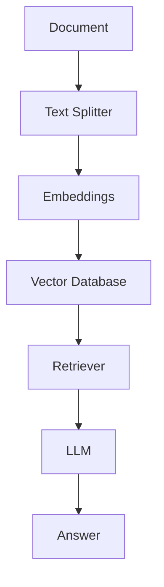

# Knowledge Chatbot

AI chatbot that answers questions based on uploaded documents.
Built using RAG (Retrieval Augmented Generation).

## Features

- **Upload markdown/text documents**
- **Automatic chunking**
- **Vector search**
- **Context-aware answers**
- **Streamlit UI**

## Tech stack

- **Python 3**
- **OpenAI** — Embeddings and chat model (e.g. `gpt-4o-mini`)
- **LangChain** — Prompt templates, text splitters, Chroma integration
- **ChromaDB** — Local vector store for embeddings
- **Streamlit** — Web UI
- **Unstructured** — Text extraction from PDF and Word files

## Architecture


## Setup

### 1. Clone and create a virtual environment

```bash
cd knowledge_chatbot
python -m venv .venv
source .venv/bin/activate   # Windows: .venv\Scripts\activate
```

### 2. Install dependencies

```bash
pip install -r requirements.txt
```

For better PDF/DOC support, you can install Unstructured extras (e.g. for markdown and PDF):

```bash
pip install "unstructured[md,pdf]"
```

(Optional; the base `unstructured` package is already in `requirements.txt`.)

### 3. Environment variables

Copy the example env file and set your OpenAI API key:

```bash
cp .env.simple .env
```

Edit `.env` and set:

| Variable | Required | Default | Description |
|----------|----------|---------|-------------|
| `OPENAI_API_KEY` | **Yes** | — | Your OpenAI API key (used for embeddings and chat) |
| `OPENAI_MODEL` | No | `gpt-4o-mini` | Chat model name (e.g. `gpt-4o`, `gpt-4o-mini`) |
| `CHROMA_PATH` | No | `chroma` | Directory where ChromaDB stores vectors (relative to project root) |

**Important:** `.env` is gitignored. Do not commit API keys.

## How to run

From the project root (with your venv activated):

```bash
streamlit run app.py
```

The app opens in your browser. Upload a file (e.g. a `.txt` or `.pdf`), wait for it to be processed once, then type questions; answers are generated from the document content via RAG.

## Usage notes

- Each uploaded file is processed **once per upload** (tracked by name and size); Streamlit reruns do not re-embed the same file.
- The vector store is **persistent**: ChromaDB data is stored under `CHROMA_PATH` (default: `chroma/`) and reused across runs.
- If you see “Unable to find matching results”, try rephrasing or uploading a document that clearly contains relevant content.
